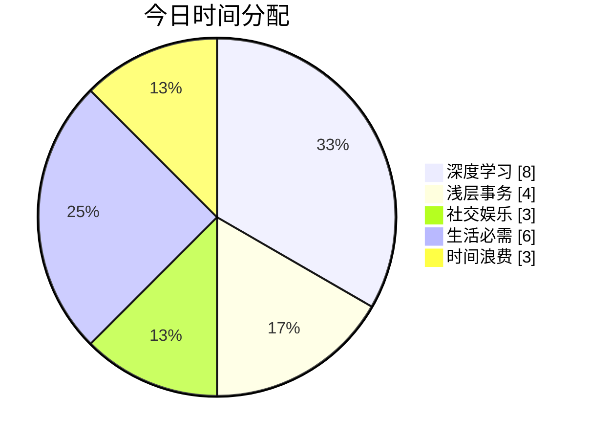
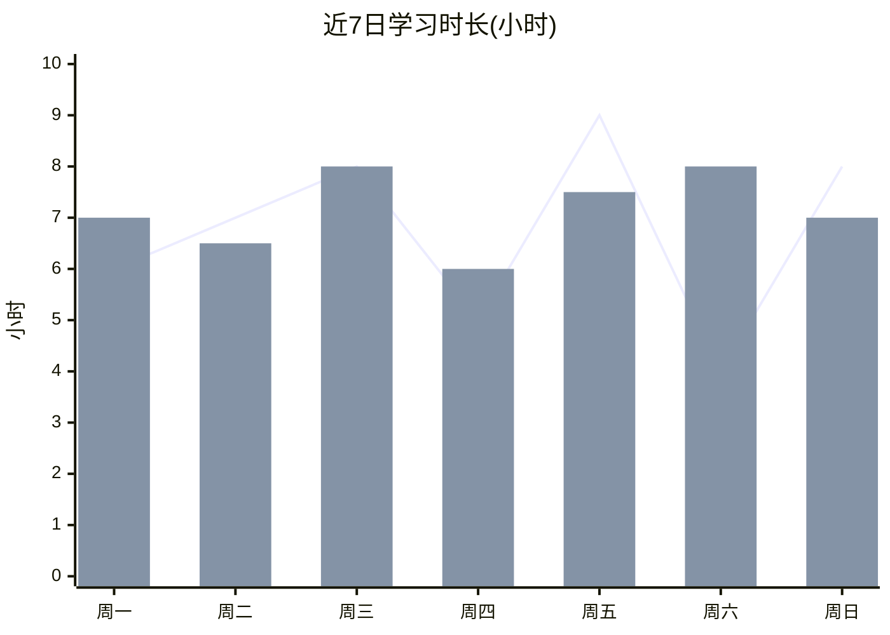
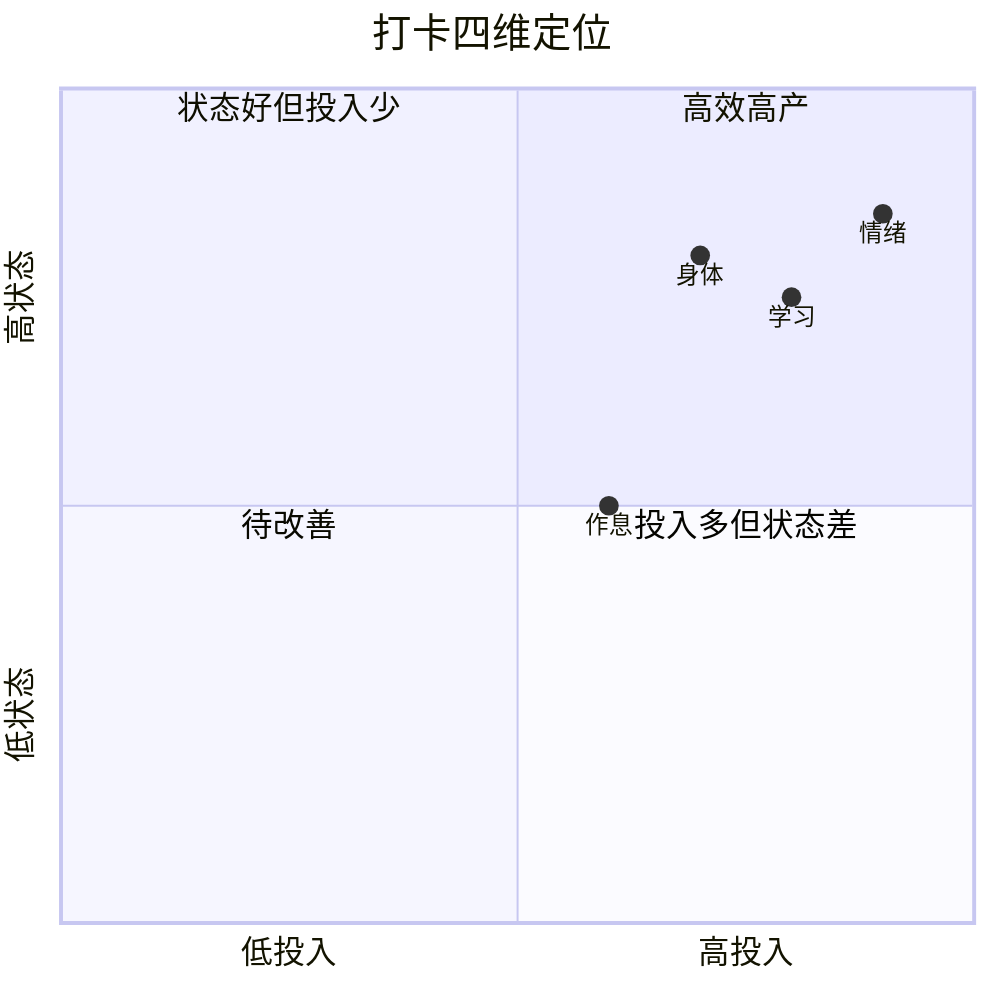
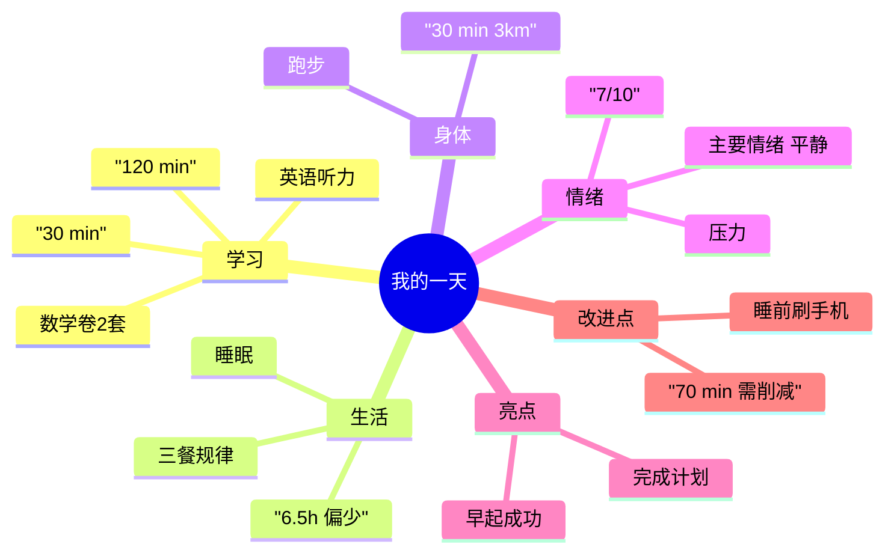
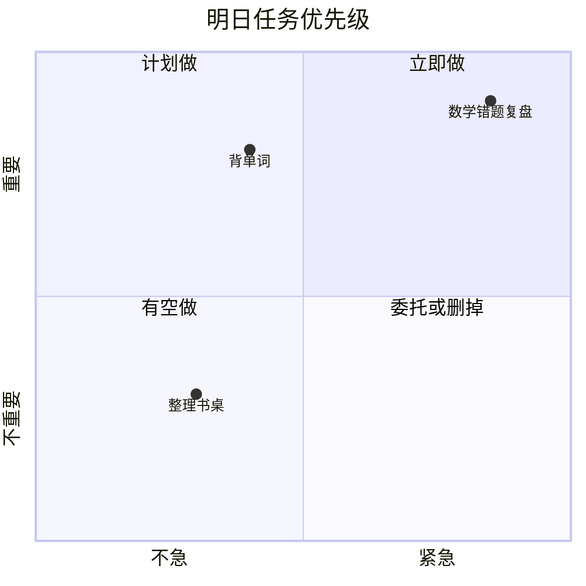
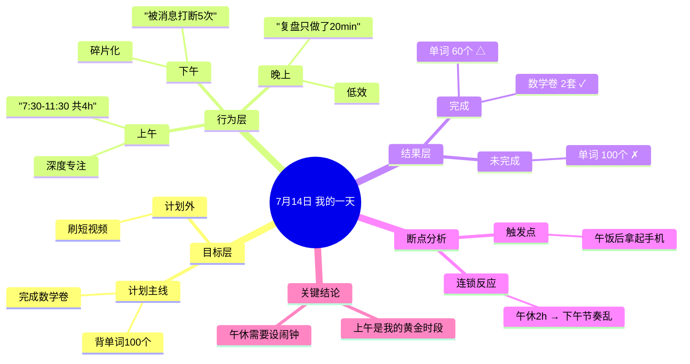
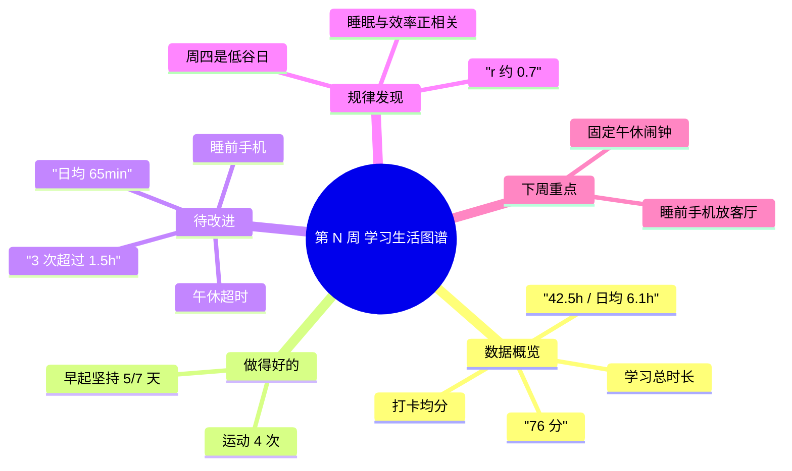

# 每日学习生活打卡 · 提示词全集（通用模板）

> 用途：把下面任意一段提示词复制给 AI（ChatGPT / 豆包 / Claude / DeepSeek / WorkBuddy 等），即可完成「记录一天 → 出图表 → 出思维导图 → 周月复盘」的完整闭环。
> 使用顺序建议：先看【场景选择表】→ 再复制对应提示词 → 数据攒够 7 天/30 天后用复盘提示词。

---

## 目录

1. [3 分钟上手：先做这三件事](#一3-分钟上手先做这三件事)
2. [场景选择表：图表和思维导图到底怎么输出](#二场景选择表图表和思维导图到底怎么输出)
3. [提示词 A：每日打卡总入口（主提示词）](#三提示词-a每日打卡总入口主提示词)
4. [提示词 B：纯文本 / Markdown 版（任何 AI 都能用）](#四提示词-b纯文本--markdown-版任何-ai-都能用)
5. [提示词 C：Mermaid 代码版（能直接渲染成图）](#五提示词-cmermaid-代码版能直接渲染成图)
6. [提示词 D：ECharts / HTML 看板版（交互式图表）](#六提示词-decharts--html-看板版交互式图表)
7. [提示词 E：每日思维导图专版](#七提示词-e每日思维导图专版)
8. [提示词 F：周复盘版](#八提示词-f周复盘版)
9. [提示词 G：月度趋势版](#九提示词-g月度趋势版)
10. [提示词 H：打卡启动器（每天只发这一句）](#十提示词-h打卡启动器每天只发这一句)
11. [数据模板：一天怎么记才不费劲](#十一数据模板一天怎么记才不费劲)
12. [常见问题与调参](#十二常见问题与调参)

---

## 一、3 分钟上手：先做这三件事

1. **固定一个记录入口**：手机备忘录 / 微信文件传输助手 / 一张纸都行，按下方[数据模板](#十一数据模板一天怎么记才不费劲)的 6 个字段随手记，不用写长句。
2. **晚上固定时间把记录丢给 AI**：直接把那段流水账粘给 AI，用[提示词 A](#三提示词-a每日打卡总入口主提示词)或[提示词 H](#十提示词-h打卡启动器每天只发这一句)。
3. **每周/每月跑一次复盘**：用[提示词 F](#八提示词-f周复盘版)和[提示词 G](#九提示词-g月度趋势版)，让 AI 告诉你哪项在退步。

> 关键心态：打卡记录的是**趋势**，不是**完美**。空格比编数字有价值得多。

---

## 二、场景选择表：图表和思维导图到底怎么输出

| 场景 | 推荐输出方式 | 用哪个提示词 | 说明 |
|---|---|---|---|
| 只想在聊天框里快速看 | 纯文本表格 + ASCII 时间轴 + 缩进树 | 提示词 B | 零门槛，所有 AI 都能输出，复制即用 |
| 用 Notion / Obsidian / 飞书 / GitHub / 语雀 | Mermaid 代码 | 提示词 C | 这些平台原生支持 Mermaid，粘贴即渲染 |
| 想要好看的彩色图表、能交互、能截图发人 | ECharts + HTML 看板 | 提示词 D | 生成单个 .html 文件，双击浏览器打开 |
| 只想理清"今天干了什么、为什么分心" | 思维导图 | 提示词 E | 单独跑，聚焦结构梳理 |
| 图文报告要发给老师/家长/团队 | Markdown + Mermaid 混排 | 提示词 A + C | 一份 Markdown 导出 PDF 即可 |
| 需要长期积累、做数据对比 | CSV / 表格 + ECharts | 提示词 D + G | 先存结构化数据，再可视化 |

**三种输出方式的能力对照**

| 维度 | 纯文本 (B) | Mermaid (C) | ECharts (D) |
|---|---|---|---|
| 渲染门槛 | 无 | 需支持 Mermaid 的平台 | 需浏览器 |
| 美观度 | ★★ | ★★★ | ★★★★★ |
| 可交互 | ✗ | 部分 | ✓ |
| 适合分享 | 文字截图 | 图截图 | HTML 文件 |
| 适合长期存档 | ✓ | ✓ | 一般 |

---

## 三、提示词 A：每日打卡总入口（主提示词）

> 这是**主提示词**，适合大多数情况。直接整段复制。

```text
# 角色
你是一位「个人效能教练 + 数据可视化助手」。你的任务是帮我把一天的学习和生活记录，整理成一份结构化、可量化、带图表的每日打卡报告。

# 输入
我会给你一段今天的流水账记录（可能很随意、有错别字、顺序混乱）。如果我没给够信息，你可以先问我最多 3 个补充问题，再开始输出。

# 处理要求

## 第一步：结构化解析
把我的一天拆成下面 6 个维度，每个维度提取「事实数据」而非感受描述：
1. 学习/工作：具体做了什么、时长（分钟）、产出物、完成度（%）
2. 生活起居：起床时间、入睡时间、三餐是否规律、睡眠时长
3. 身体状态：运动类型与时长、步数、身体不适、精力自评（1-10）
4. 情绪状态：主要情绪、情绪波动事件、压力自评（1-10）
5. 时间分配：把清醒时间归类为「深度学习 / 浅层事务 / 社交娱乐 / 生活必需 / 浪费」五类，估算小时数，合计不超过 24
6. 反思与明日计划：今天的收获、卡点、明天最重要的 1 件事

## 第二步：计算指标
- 学习专注总时长（分钟）
- 深度工作时长占比 = 深度学习 ÷ (深度学习 + 浅层事务 + 社交娱乐 + 浪费)
- 计划完成率 = 实际完成 ÷ 计划完成
- 综合打卡得分（满分 100）：学习 40% + 作息 20% + 身体 20% + 情绪 20%
  各项按 1-10 打分换算后加权
- 与昨日/近 7 日平均的对比（若有历史数据；没有就标注"暂无对比"）

## 第三步：输出报告（严格按此结构）

### 📅 打卡日报 · YYYY年MM月DD日（周X）
**今日金句**：（一句话总结今天，要有画面感，不要鸡汤）

### 一、数据总览
| 指标 | 今日 | 昨日/7日均值 | 变化 |
|---|---|---|---|
| 学习专注时长 | | | |
| 睡眠时长 | | | |
| 运动时长 | | | |
| 综合打卡得分 | | | |

### 二、一天时间轴
用时间轴形式呈现 06:00–24:00 的关键节点。

### 三、五类时间分配
用表格给出五类时间的时长与占比，并给出占比条形示意。

### 四、可视化图表
根据我的使用场景输出图表（默认用 Mermaid）：
1. 时间分配饼图
2. 近 7 日学习时长折线图
3. 四维打卡雷达图（学习/作息/身体/情绪）
4. 每小时精力曲线（若能推断）
每张图前用一句话说明它说明了什么问题，图后给一句结论。

### 五、思维导图
用 Mermaid mindmap 输出今天的思维导图，中心是「我的一天」，
一级分支为：学习、生活、身体、情绪、亮点、改进点。
每个一级分支下至少 2 个二级节点，重要节点标注具体数据。

### 六、教练点评
- ✅ 今天做得好的 3 件事（基于数据，不空夸）
- ⚠️ 需要警惕的 2 个信号（指出数据异常或模式风险）
- 🎯 明天只做 1 件最重要的事（给出具体的、可执行的动作，含时间与时长）

# 输出格式要求
- 用 Markdown，善用表格、加粗、emoji 分节（emoji 只在标题用）
- 数字必须精确到具体值，不许用"较多""还行"这类模糊词
- 如果某项数据我没有提供，写「未记录」，绝不允许编造
- 整体篇幅控制在 800–1200 字，图表代码不计入

# 语气
像一个专业、直接、不油腻的教练。指出问题时直说，但给出可执行的改法。

---

我的今日记录如下：
【在这里粘贴你的流水账】
```

---

## 四、提示词 B：纯文本 / Markdown 版（任何 AI 都能用）

> 适用：AI 不支持代码渲染，或你只想在聊天框里看。整段替换提示词 A 的「第四步：可视化图表」。

```text
# 任务
把今天的时间与状态数据，用纯文字 + 表格 + ASCII 图形表达，不要输出任何代码块图形，不要用 Mermaid。

## 1. 时间分配条形图（ASCII）
用「█」表示时间，1 个 █ = 1 小时，最长 12 个。
示例：
深度学习   ████████ 8.0h  33%
浅层事务   ████ 4.0h  17%
社交娱乐   ███ 3.0h  13%
生活必需   ██████ 6.0h  25%
时间浪费   ███ 3.0h  12%

要求：
- 按时长从多到少排序
- 每行末尾给出小时数与占比
- 占比与小时数必须与表格数据一致

## 2. 时间轴（ASCII）
横向或纵向时间轴，标出 06:00–24:00 的关键节点，形如：
06:30 起床 ─ 07:10 晨读 ─ 08:00 上课 ─ ...
每个节点标注时长与产出。

## 3. 状态趋势表
| 日期 | 学习(h) | 睡眠(h) | 运动(min) | 精力 | 情绪 | 得分 |
只用我提供的日期，未提供的写「—」

## 4. 四维评分（用方块表示）
学习专注  ▰▰▰▰▰▰▰▰▱▱  8/10
作息规律  ▰▰▰▰▰▰▱▱▱▱  6/10
身体状态  ▰▰▰▰▰▰▰▱▱▱  7/10
情绪状态  ▰▰▰▰▰▰▰▰▰▱  9/10

## 5. 思维导图（缩进树形式）
用纯文字缩进表达层级，形如：
我的一天
├─ 学习
│  ├─ 完成数学卷 2 套（120 min）
│  └─ 英语听力 30 min
├─ 生活
│  ├─ 睡眠 6.5h（偏少）
│  └─ 三餐规律 ✓
└─ 改进点
   └─ 睡前刷手机 70 min → 改为纸质书 20 min

要求：
- 层级符号用 ├─ │ └─，保证对齐
- 一级分支：学习、生活、身体、情绪、亮点、改进点
- 数据与前面的表格完全一致
- 不使用 emoji 之外的任何图形代码
```

---

## 五、提示词 C：Mermaid 代码版（能直接渲染成图）

> 适用：Notion / Obsidian / 飞书文档 / 语雀 / GitHub / Typora / VSCode。粘贴后自动渲染。
> 注意：Mermaid 的 `%%` 是注释；节点文字含括号、逗号时**必须用英文双引号包起来**，否则报错。

```text
# 任务
把我今天的数据，输出为可直接渲染的 Mermaid 代码。每段代码放在独立的 ```mermaid 代码块中。
⚠️ 硬性约束：
1. 所有节点文字含括号、逗号、斜杠、百分号时，一律用英文双引号包裹
2. 不要使用 Mermaid 尚不支持的语法
3. 数量、占比必须与数据一致，不许编造
4. 每段图表后附一句「这张图说明了什么」的结论

## 图 1：时间分配饼图


## 图 2：近 7 日学习与睡眠趋势（折线图）
使用 xychart-beta 语法：

（line = 学习时长，bar = 睡眠时长）

## 图 3：四维打卡雷达图
Mermaid 无原生雷达图，用 quadrantChart 或改为「四维评分条形图 + 文字雷达描述」：


## 图 4：今日事件流程图（甘特式时间线）

```mermaid
gantt
    title 今日时间线
    dateFormat HH:mm
    axisFormat %H:%M
    section 上午
    起床与早餐 :a1, 06:30, 60m
    数学复习   :a2, 07:30, 120m
    section 下午
    专业课     :b1, 14:00, 150m
    section 晚上
    英语听力   :c1, 20:00, 30m
    复盘记录   :c2, 22:30, 30m
```


## 图 5：思维导图


## 图 6：明日计划优先级矩阵

```

---

## 六、提示词 D：ECharts / HTML 看板版（交互式图表）

> 适用：想要好看的彩色图表、鼠标悬停能看数值、能截图发人、能当桌面看板。
> 产出一个单文件 HTML，双击即可用浏览器打开，无需服务器、无需联网（若走 CDN 需联网，见下方说明）。

```text
# 任务
根据我提供的一天（或多天）打卡数据，生成一个**单文件 HTML 数据看板**。

# 技术要求
1. 输出**一个完整可直接运行的 .html 文件**，包含 <!DOCTYPE html> 到 </html>
2. 使用 ECharts 5（通过 CDN 引入：https://cdn.jsdelivr.net/npm/echarts@5/dist/echarts.min.js）
3. 同时用 Mermaid（CDN：https://cdn.jsdelivr.net/npm/mermaid@10/dist/mermaid.min.js）渲染思维导图
4. 所有数据写在 <script> 顶部的 `const data = {...}` 里，方便我日后直接改
5. 响应式布局：宽屏 3 列，窄屏自动堆叠为 1 列
6. 中文界面，字体用系统默认（-apple-system, "Microsoft YaHei", sans-serif）
7. 页面内不要出现任何外部图片依赖

# 看板内容（从上到下）
1. **顶部标题区**：日期、周几、今日金句、综合打卡得分（大号数字 + 环形进度）
2. **核心指标卡片**：4 个卡片 —— 学习时长 / 睡眠时长 / 运动时长 / 精力自评，每个显示今日值与较昨日的涨跌箭头（涨红色、跌绿色：遵循中国习惯，红色代表上升）
3. **图表区（2x3 网格）**：
   - 饼图：今日五类时间分配（深度学习/浅层事务/社交娱乐/生活必需/时间浪费）
   - 折线图：近 7 日学习时长趋势（带面积渐变）
   - 柱状图：近 7 日睡眠时长（标出 7 小时目标线）
   - 雷达图：四维打卡评分（学习/作息/身体/情绪），满值 10，附本周均值的第二组数据做对比
   - 堆叠柱状图：近 7 日每日五类时间堆叠
   - 折线图：近 7 日精力与情绪双曲线（双 Y 轴或同轴 1-10）
4. **思维导图区**：用 Mermaid mindmap 渲染「我的一天」，中心为日期
5. **打卡日历热力图**：最近 30 天，颜色深浅表示打卡得分（0-100），仿 GitHub 贡献图
6. **教练点评区**：三栏 —— ✅ 做得好 / ⚠️ 需警惕 / 🎯 明日一件事

# 设计风格
- 深色模式优先（背景 #0f1115，卡片 #171a21，主色 #4f8cff，强调色 #22c55e）
- 圆角 16px，卡片有轻微边框和柔和阴影，整体科技感、留白充足
- 图表配色统一色系：蓝 #4f8cff / 青 #22d3ee / 绿 #22c55e / 橙 #f59e0b / 红 #ef4444 / 紫 #a855f7
- 得分环形进度按区间变色：≥85 绿、70-84 蓝、60-69 橙、<60 红

# 数据
以下是我的打卡数据（JSON 或流水账，如只有一天就只渲染当天 + 已有历史）：

【在这里粘贴数据】

# 交付方式
直接给我完整 HTML 代码（放在一个代码块里）。
如果我的环境支持写文件，请同时保存为 `打卡看板-YYYYMMDD.html`。

# 例外说明
若我的记录里某些字段缺失，请在图表中用 0 或「未记录」占位，
并在页面顶部用一条灰色提示条列出「缺失字段」，绝不允许编造数据。
```

**离线化改造提示**：如果你希望完全离线使用，把提示词第 2、3 条改为「将 ECharts 与 Mermaid 的压缩源码内嵌进 HTML 的 `<script>` 标签中」——文件会变大（约 1MB），但断网也能打开。

---

## 七、提示词 E：每日思维导图专版

> 适用：不想要一堆表格，只想快速理清"今天到底怎么过的、问题出在哪"。

```text
# 角色
你是一位擅长结构化思考的教练。请把我的零散记录，整理成一张能一眼看懂自己一天的思维导图。

# 分析步骤
1. 从我的记录里提取所有**事实**（时间、地点、行为、时长、结果），剔除形容词
2. 按「目标层 → 行为层 → 结果层」重构：我原计划做什么 → 实际做了什么 → 得到了什么
3. 标出**断点**：计划与实际之间的落差发生在哪一刻、由什么触发

# 输出结构（Mermaid mindmap）



# 附加要求
- 一级分支固定为：目标层、行为层、结果层、断点分析、关键结论
- 每个数据节点必须带具体数字
- 节点文字含空格或标点时用英文双引号包裹
- 思维导图之后，用 3 句话总结「今天最大的一个模式」
- 再给 3 条「明天可立即执行的微调动作」，每条不超过 15 字，必须具体到时间点

# 我的记录
【粘贴】
```

---

## 八、提示词 F：周复盘版

> 适用：攒够 7 天后跑一次。这是**最有价值**的一份提示词。

```text
# 角色
你是一位严格但支持性的个人效能教练。请基于我过去 7 天的打卡数据，输出一份周复盘报告。
原则：**用数据说话，不客套，不空夸**。每个结论必须能找到对应的数据支撑。

# 输出结构

## 一、本周总览
| 指标 | 本周合计 | 日均 | 上周日均 | 环比变化 |
|---|---|---|---|---|
| 学习时长 | | | | |
| 睡眠时长 | | | | |
| 运动时长 | | | | |
| 平均打卡得分 | | | | |
| 深度工作占比 | | | | |

## 二、趋势图
用 Mermaid xychart-beta 输出：
1. 本周每日学习时长（柱）+ 睡眠时长（线）
2. 本周每日打卡得分折线
3. 五类时间的本周累计占比饼图

## 三、模式识别（重点）
请从数据中找出并说明：
1. **黄金时段**：我一周中效率最高的时段是？（用数据说明，如"上午 8-11 点产出占全周 42%"）
2. **黑洞时段**：时间流失最严重的时段与原因
3. **关联规律**：例如「睡眠 < 7h 的第二天，学习时长平均下降 X min」
4. **情绪与效率的关系**：情绪好的日子效率是否更高，幅度多少

## 四、周思维导图


## 五、评分诊断
对四个维度分别打分（1-10）并给出理由：
- 学习：分数 + 依据（引用具体数据）+ 改进建议
- 作息：同上
- 身体：同上
- 情绪：同上

## 六、下周行动计划
给出**不超过 3 条**行动，每条必须包含：
- 具体动作（做什么）
- 触发时机（什么时候做）
- 成功标准（怎么算做到了，需可量化）
- 失败的替代方案（做不到时降级为什么）

格式示例：
> **行动 1**：23:00 前把手机放到客厅充电
> 触发：每晚 22:45 闹钟
> 成功标准：本周至少 5 天做到
> 降级方案：做不到时，至少把手机调成飞行模式

## 七、一句话
用一句话总结这一周，然后是给下周的一句话提醒。

# 要求
- 数据缺失的项标注「未记录」，不要补全
- 趋势图里只能使用我真实提供的日期
- 结论必须引用数字，警惕"感觉式"判断

# 我的 7 天数据
【粘贴 7 天记录】
```

---

## 九、提示词 G：月度趋势版

```text
# 任务
基于我过去 30 天的打卡数据，输出一份月度趋势报告。重点是**长期趋势**和**习惯养成进度**，而不是单日得失。

# 输出结构
1. **月度仪表盘**：学习总时长 / 打卡天数 / 打卡率 / 平均分 / 最长连续打卡
2. **30 日热力图**：用 Mermaid 或 ASCII 表达每日得分深浅，仿 GitHub 贡献图
3. **周对比柱状图**：把 30 天按周聚合，看四周走势是否在改善
4. **习惯养成进度表**：
   | 习惯 | 目标频次 | 实际完成 | 完成率 | 趋势 |
   | 早起 | 25/30 | 21 | 84% | ↑ |
   | 运动 | 15/30 | 9 | 60% | ↓ |
5. **相关性发现**：至少 3 条，如「运动日的次日学习时长平均 +48 min」
6. **月度思维导图**：中心为「我的这个月」，一级分支：数据、突破、瓶颈、规律、下月目标
7. **下月三大目标**：SMART 原则，每个附衡量方式

# 要求
- 用 Mermaid 代码块输出所有图表
- 如果某周数据缺失，明确标注「该周数据不足，未参与趋势计算」
- 强调**方向**胜过**绝对值**：请明确指出哪些指标在改善、哪些在恶化
- 最后给出一句「本月我给自己的评语」，不超过 30 字

# 我的 30 天数据
【粘贴】
```

---

## 十、提示词 H：打卡启动器（每天只发这一句）

> 每天只复制这一句 + 你的流水账，省事。

```text
用「每日打卡总入口」的规则处理我的今日记录。
要求：
1. 输出结构：数据总览表 → 时间轴 → 五类时间分配 → 图表（Mermaid 版）→ 思维导图 → 教练点评
2. 图表用 Mermaid 代码块，节点文字含标点时用英文双引号包裹
3. 数据缺失写「未记录」，禁止编造
4. 结尾必须给出「明天只做 1 件最重要的事」，含具体时间和时长
5. 如果我有历史记录，请对比近 7 日均值

我的今日记录（YYYY-MM-DD）：
【粘贴】
```

---

## 十一、数据模板：一天怎么记才不费劲

**核心思路：只记 6 个字段，每条不超过 15 字。**

```text
日期：2026-07-14

【作息】
起床 6:30 / 入睡 23:40 / 睡眠 6.8h

【学习】
- 数学卷 2 套  7:30-11:30  240min  完成度 100%
- 英语听力    20:00-20:30  30min  完成度 80%

【生活】
三餐：早✓ 午✓ 晚✓  /  午休 90min

【身体】
跑步 30min 3km  /  步数 8200  /  精力 7/10

【情绪】
主要平静，下午被一条消息打断后烦躁了 1 小时 / 压力 6/10

【其他时间】
刷短视频 70min（21:00-22:10）
通勤 60min
和朋友电话 40min

【反思】
今天上午效率很高，下午被打断后就散了。主要问题是午休睡太久。

【明日最重要 1 件事】
上午 8:00-10:00 完成数学错题复盘
```

**进阶：用一句话极简版**

```text
7/14 | 6:30起23:40睡 | 数学240min英语30min | 跑30min | 精力7压力6
| 刷手机70min | 上午高效下午散 | 明天复盘错题
```

---

## 十二、常见问题与调参

### Q1：图表类型可以换吗？
可以。在提示词里加一句即可，例如：
- 「把饼图换成旭日图」→ 更清晰地看层级
- 「用桑基图展示时间流向」→ 看时间从哪流到哪
- 「用燃尽图展示本周任务完成情况」
- 「用雷达图对比本周与上周四个维度」

### Q2：Mermaid 报错怎么办？
在提示词里加这段约束（本文件已内置）：
> 所有节点文字含括号、逗号、斜杠、百分号、冒号时，一律用英文双引号包裹；不要使用未渲染验证过的语法；如果某图类型不被支持，改用最接近的替代类型并说明。

### Q3：不想每天给 AI 重复粘贴历史数据？
在提示词里加：
> 我会在同一次对话中持续给你数据。请记住之前所有日期的数据，每次只处理今天的新数据，但在对比时自动引用历史。如果你认为上下文过长，请主动提醒我并输出一份数据摘要供我保存。

### Q4：想让它更严格 / 更温和？
在「# 语气」部分替换：
- 严格版：「像一位不留情面的数据审计员，指出任何自欺欺人的地方，不鼓励，只讲事实」
- 温和版：「像一位耐心的朋友，先肯定再建议，语气自然，避免说教」

### Q5：想加分数或者星级？
在「第二步：计算指标」加：
> 每个维度用 ★ 表示等级：★☆☆☆☆ 到 ★★★★★，并在表格中展示。

### Q6：每天定时自动生成怎么办？
WorkBuddy 支持定时自动化任务。可以说：
> 每天晚上 22:30 提醒我记录今天的打卡数据，并在我提供数据后生成日报。

或改造一句话版：
> 每天晚上 22:30，用「每日打卡总入口」的规则生成本日打卡日报，若我没有提供数据，则先生成一份空白模板提醒我填写。

### Q7：怎么让报告真的有用？
三条经验：
1. **连续记录比单日完美重要**。断了一天不要重开，接着记。
2. **对比才有意义**。单看"学习 5 小时"没感觉，看"比昨天多 1 小时但比上周少 1.5 小时"才有。
3. **只用最后那条「明天只做 1 件事」**。日报再漂亮，不落地也是自我安慰。把这条写进明天的计划里。

---

## 附：极简复制区

> 只想要一条能用的？复制这个。

```text
你是一位个人效能教练 + 数据可视化助手。
我会给你我今天的流水账记录，请输出一份打卡日报，包含：
1. 数据总览表（学习时长/睡眠/运动/打卡得分，对比近7日均值）
2. 一天时间轴
3. 五类时间分配（深度学习/浅层事务/社交娱乐/生活必需/浪费）及占比
4. Mermaid 图表：时间分配饼图、近7日学习折线图、四维雷达/象限图
5. Mermaid mindmap 思维导图，中心「我的一天」，分支：学习/生活/身体/情绪/亮点/改进点
6. 教练点评：✅做得好3条 / ⚠️需警惕2条 / 🎯明天只做1件最重要的事
约束：数据精确，缺失写「未记录」不许编造；节点文字含标点用英文双引号包裹；Markdown 输出，800-1200字。

我的今日记录：
【粘贴】
```

---

*文档版本 v1.0 · 适用于各类 AI 对话工具 · 可直接分发使用*
